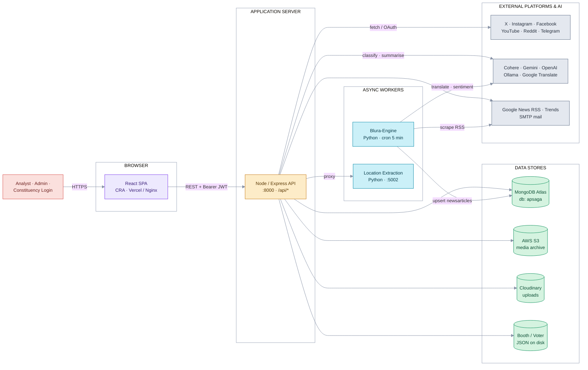
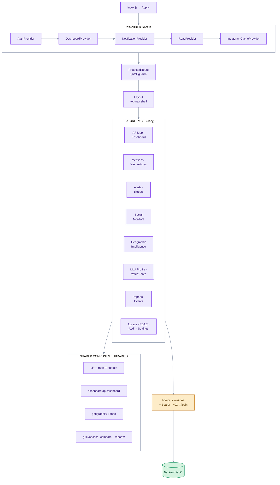
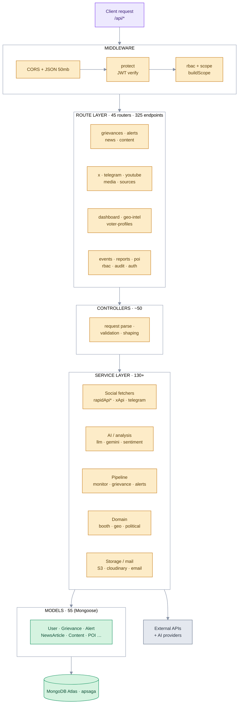
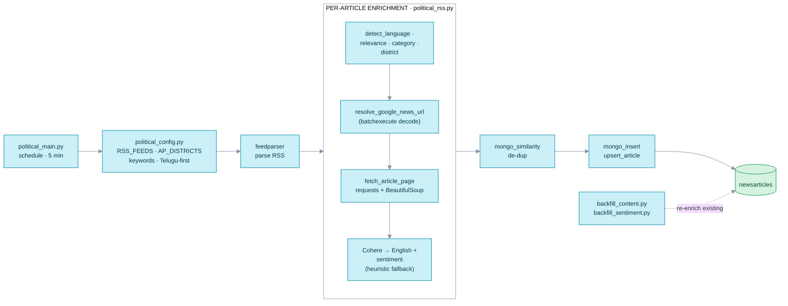
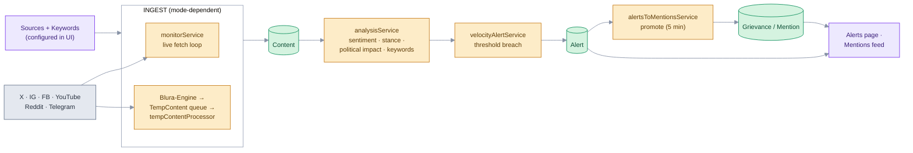
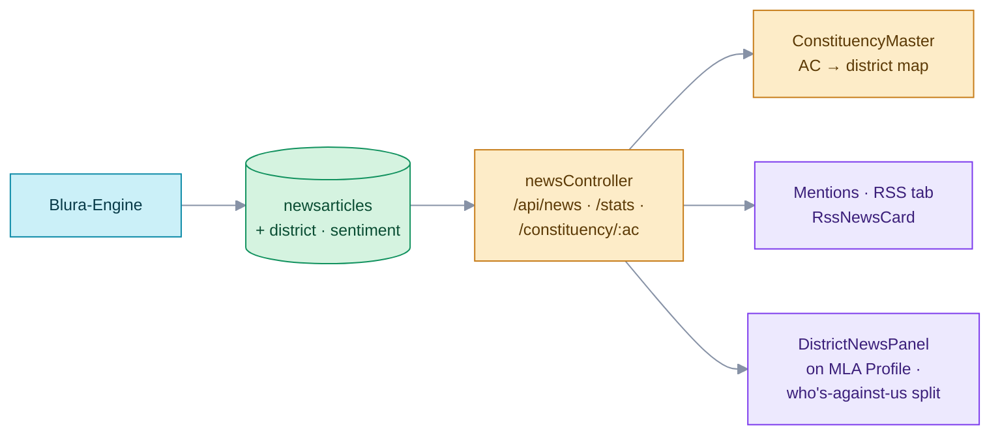
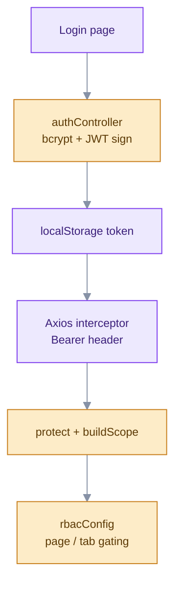
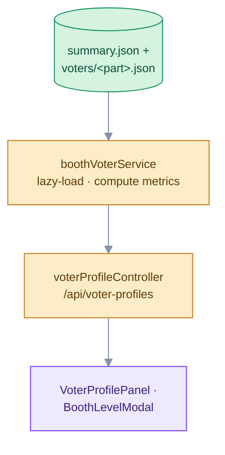

# AP Political Watch — System Architecture

> **AP.Blura.Saga** — a TDP / Andhra Pradesh social-media & news monitoring platform.
> Three cooperating processes (React SPA · Node/Express API · Python news engine) over one shared MongoDB,
> wired to a dozen external platforms. This document diagrams every layer and the flows that connect them.

| Metric | Count | | Metric | Count |
|---|---|---|---|---|
| Runtime processes | **3 (+1 aux)** | | REST endpoints | **325** |
| SPA pages / routes | **55+** | | API routers | **45** |
| React components | **150+** | | Backend services | **130+** |
| React context providers | **5** | | Data models | **55** |
| Background jobs | **6+** | | MongoDB (shared) | **`apsaga`** |

**Stack:** React (CRA) · Node/Express · Python · MongoDB Atlas &nbsp;•&nbsp; **Auth:** JWT + RBAC &nbsp;•&nbsp; **Domain:** AP political monitoring

### Color legend (diagrams)

| | Subsystem |
|---|---|
| 🟪 violet | Frontend / Client |
| 🟧 amber | Backend / API |
| 🟦 cyan | Python Engine |
| 🟩 green | Data Store |
| ⬜ slate | External API |
| 🟥 rose | Actor |

---

## Table of Contents

1. [System Context](#01--system-context)
2. [Frontend Architecture](#02--frontend-architecture)
3. [Backend Architecture](#03--backend-architecture)
4. [Blura-Engine · News Pipeline](#04--blura-engine--news-pipeline)
5. [End-to-End Data Flows](#05--end-to-end-data-flows)
6. [Feature Module Map](#06--feature-module-map)
7. [API Surface](#07--api-surface)
8. [Data Stores](#08--data-stores)
9. [External Integrations](#09--external-integrations)
10. [Background Jobs](#10--background-jobs)

---

## 01 · System Context

A single-page app talks REST+JWT to the Node API; the Python **Blura-Engine** writes news straight into the same
database on a 5-minute cron; media is archived to S3 and Cloudinary; and a Python location micro-service is
reverse-proxied through the API to avoid mixed-content.

> Three runtime processes + one auxiliary micro-service, unified by the `apsaga` database.

---

## 02 · Frontend Architecture

A Create-React-App SPA. Boot flows through a nested provider stack, then a `ProtectedRoute` gate wraps a shared
`Layout`. Every page is lazy-loaded; all traffic passes through one Axios instance that injects the JWT and
force-logs-out on `401`.

> `react-router-dom` v7 · recharts · react-simple-maps + d3-geo · framer-motion · CKEditor.

**5 context providers**

- **AuthContext** — JWT in localStorage, user identity
- **RbacContext** — page + tab visibility per role
- **DashboardContext** — shared filters / date range
- **NotificationContext** — toast + alert badges
- **InstagramCacheContext** — profile memo cache

**Visualization / rendering**

- **recharts** — sentiment, trend, source charts
- **react-simple-maps + d3-geo** — AP choropleth
- **framer-motion** — panels & transitions
- **jspdf + html2canvas** — report export

**Auth boundary** — Every call → Axios interceptor attaches `Bearer`; a `401` clears the token and redirects to
`/login`. Location lookups hit the proxied Python service.

---

## 03 · Backend Architecture

Classic layered Express: **route → middleware → controller → service → model → Mongo**. Middleware handles CORS,
JWT verification (`protect`), role checks and scope-building. A fleet of services isolates every external
integration and the AI/analysis pipeline.

> A `USE_ENGINE` flag swaps the live monitoring loop for a **TempContent** queue drained from the engine.

**130+ services, by role**

- **Social fetch** — `rapidApiX/Instagram/Facebook`, `xApiService`, `redditService`, `telegramService`, `youtube.service`, `agent-twitter-client`, `puppeteer`
- **AI / NLP** — `llmProvider`, `geminiService`, `openaiGlanceService`, `ollamaLLMService`, `sentimentService`, `politicalSentimentService`, `translationService`, `keywordGenService`
- **Pipeline** — `monitorService`, `tempContentProcessor`, `grievanceService`, `grievanceWorkflowService`, `alertsToMentionsService`, `velocityAlertService`
- **Domain** — `boothVoterService`, `voterProfileService`, `constituencyMasterService`, `geoIntel`, `politicalImpactService`, `unrestPredictorService`, `engagerAnalysisService`

**Cross-cutting**

- **authMiddleware** — `protect` (Bearer→JWT→User) & `authorize(roles)`
- **rbacMiddleware / scopeMiddleware** — page & constituency scoping via `buildScope`
- **cacheService** — in-memory warm caches (gated alerts, profiles)
- **auditService** — action logging → `AuditLog`
- **Default seeds** — superadmin `admin@apwatch.in`, grievance admin, settings, thresholds, calendar

---

## 04 · Blura-Engine · News Pipeline

A standalone Python process that scrapes ~40 RSS feeds (national EN, AP EN, and Telugu papers — Eenadu, Sakshi,
Andhrajyothy, TV9 — plus district-wise Google News), decodes Google's redirect URLs, enriches with Cohere, and
upserts de-duplicated articles into the same `newsarticles` collection the API reads.

> `DB/mongo_connect.py` loads `backend/.env`, so engine + API share one database. Cohere is optional (keyed by `COHERE_API_KEY`).

---

## 05 · End-to-End Data Flows

Five journeys trace a datum from origin to the pixel a user sees.

### A · Social monitoring → Alerts → Mentions

### B · Mention analysis & grievance workflow

```mermaid
%%{init:{'theme':'base','themeVariables':{'fontFamily':'ui-monospace,monospace','fontSize':'12.5px','lineColor':'#8792a6','textColor':'#8792a6','clusterBkg':'transparent','clusterBorder':'#9aa4b8'}}}%%
flowchart LR
  FE1["rapidApiXService<br/>fetch mentions"]:::be
  GS["grievanceService<br/>analyzeGrievanceContent"]:::be
  AS["analysisService<br/>BSK-relative sentiment ·<br/>stance · target entity · risk"]:::be
  LOC["locationClassifierService<br/>→ AP district / AC"]:::be
  G[("Grievance")]:::data
  WF["Workflow codes<br/>criticism · query · suggestion"]:::be
  RPT["Reports ·<br/>CriticismReport · QueryReport"]:::data
  UI["Mentions page<br/>filter · edit sentiment · FIR"]:::fe
  FE1 --> GS --> AS --> LOC --> G --> WF --> RPT --> UI
  G --> UI
  classDef fe fill:#ede9fe,stroke:#7c3aed,color:#3b1f7a;
  classDef be fill:#fdecc8,stroke:#c77d1a,color:#5c3a06;
  classDef data fill:#d5f3e0,stroke:#12925f,color:#0a4d33;
```

### C · News → constituency drill-down

### D · Auth & RBAC

### E · Booth / voter (file-based)

> **Sentiment scheme** everywhere: `positive` · `moderate` · `negative` (`neutral` is a legacy alias for `moderate`).

---

## 06 · Feature Module Map

The application decomposes into ~16 functional modules. Each binds pages ↔ endpoints ↔ models.

| Module | Key pages | Endpoints / services |
|---|---|---|
| **AP Map & Dashboard** — command center, choropleth, KPIs, AI insights | `AndhraPradeshMap`, `DashboardNew` | `/api/dashboard` |
| **Geographic Intelligence** — district/city drill-down, risk, playback | `GeographicIntelligence` | `/api/geo-intel`, `/api/constituency-intel` |
| **Mentions / Grievances** — mention feed + RSS news, sentiment, FIR | `Grievances` | `/api/grievances` (29), `/api/news` |
| **Alerts & Threats** — velocity alerts, engager analysis, escalation | `Alerts`, `ActiveThreats` | `/api/alerts` (19), `/api/alert-thresholds` |
| **Social Monitors** — X, FB, IG (+profiles/stories), YouTube, Telegram | `XMonitor`, `FacebookMonitor`, `InstagramMonitor`, `YouTubeMonitor`, `Telegram` | `/api/x` (27), `/api/telegram` (19), `/api/youtube` (12) |
| **Web Articles** — public web article search/monitoring | `PublicWebArticles` | `/api/web-articles`, `webArticleSearchService` |
| **Voter / Booth Intelligence** — booth rolls, demographics, sentiment | `VoterProfilePanel`, `BoothLevelModal` | `/api/voter-profiles`, `boothVoterService` |
| **MLA / MP Profiles** — per-constituency profile, district news, compare | `MlaProfile`, `compare/` | `/api/admin` |
| **Events & Programmes** — events, ongoing, daily, master calendar | `Events`, `EventsReport` | `/api/events` (15), `/api/daily-programmes`, `/api/master-calendar` |
| **Reports & Intelligence** — unified reports, generation, export | `UnifiedReports`, `IntelligenceDashboard`, `GenerateReport` | `/api/reports`, `/api/intelligence-reports`, `/api/export` |
| **Person of Interest** — POI dossiers, profile-image mgmt | `PersonOfInterest`, `POIDetail` | `/api/poi` |
| **Dial-100 Incidents** — incident reporting & tracking | `Dial100IncidentReporting` | `/api/dial100-incidents` |
| **Deepfake Analysis** — media forensics / deepfake detection | `DeepfakeAnalysis` | `/api/deepfake`, `mediaAnalyzerService` |
| **Search & Trends** — global search, analytics, Google Trends | `GlobalSearch`, `SearchAnalytics` | `/api/search`, `/api/search-trends` |
| **Policies & Templates** — platform policy manager, legal, templates | `PolicyManager` | `/api/policies`, `/api/templates` |
| **Access · RBAC · Audit** — access mgmt, constituency logins, audit | `AccessManagement`, `ConstituencyLogins`, `AuditLogs`, `Settings`, `Sources` | `/api/rbac`, `/api/audit`, `/api/settings` |

---

## 07 · API Surface

**325 endpoints** across **45 routers**, all mounted under `/api`. The busiest routers carry the monitoring,
social-action, and admin workloads.

| Base path | Router | Endpoints | Responsibility |
|---|---|--:|---|
| `/api/grievances` | `grievanceRoutes` | 29 | Mentions CRUD, fetch, analyze, status, FIR |
| `/api/x` | `x.routes` | 27 | X OAuth, actions, bulk ops, accounts |
| `/api/admin` | `profileSettingsRoutes` | 20 | MLA + global profile settings |
| `/api/alerts` | `alertRoutes` | 19 | Alerts, ack, escalate, reports, engagers |
| `/api/telegram` | `telegramRoutes` | 19 | Groups, messages, sync |
| `/api/events` | `eventRoutes` | 15 | Events lifecycle |
| `/api/dashboard` | `apDashboardRoutes` | 12 | AP KPIs, sentiment, districts, map, AI insights |
| `/api/youtube` | `youtube.routes` | 12 | Channel/video monitoring, transcripts |
| `/api/news` | `newsRoutes` | 11 | RSS articles, keywords, languages, sentiment |
| `/api/criticism` | `criticismRoutes` | 10 | Criticism workflow & contacts |
| `/api/grievance-workflow` | `grievanceWorkflowRoutes` | 10 | Grievance workflow reports |
| `/api/daily-programmes` | `dailyProgrammeRoutes` | 10 | Daily programme scheduling |
| `/api/templates` · `/query-workflow` · `/media` | `templates` · `query` · `media` | 8–9 | Templates, query workflow, media |
| `/api/content` · `/poi` · `/search` · `/geo-intel` · `/rbac` · `/instagram-stories` · `/suggestion` | *various* | 7 | Content, POI, search, geo, rbac, IG stories, suggestions |
| `/api/reports` · `/sources` · `/auth` · `/constituency-intel` · `/voter-profiles` | *various* | 5–6 | Reports, sources, auth, constituency intel, voter/booth |
| `/api/intelligence` · `/keywords` · `/master-calendar` · `/ongoing-events` | *various* | 4 | Intelligence dashboard, keywords, calendar, ongoing events |
| `/api/deepfake` · `/analytics` · `/unrest` · `/uploads` | *various* | 3 | Deepfake, analytics, unrest, uploads |
| `/api/dial100-incidents` · `/export` · `/intelligence-reports` | *various* | 2 | Incidents, export, intel reports |
| `/api/audit` · `/threats` · `/search-trends` · `/web-articles` · `/alert-thresholds` | *various* | 1 | The long tail |

---

## 08 · Data Stores

One MongoDB Atlas database (`apsaga`, ~55 Mongoose models) is the system of record. Binary media lives in S3 &
Cloudinary; static electoral rolls live as JSON on disk.

### MongoDB · `apsaga` — 55 collections

| Group | Collections |
|---|---|
| **Identity / Access** | `User`, `PagePermission`, `AuditLog` |
| **Monitoring** | `Content`, `TempContent`, `Source`, `GrievanceSource`, `Keyword`, `ManualReviewQueue` |
| **Social** | `TwitterAccount`, `XOAuthAccount`, `XBulkAction`, `TelegramGroup`, `TelegramMessage`, `InstagramStory`, `YouTubeTranscript`, `EngagerAnalysis`, `PeriscopeUpload` |
| **Grievance** | `Grievance`, `GrievanceSettings`, `GrievanceWorkflowReport`, `CriticismReport`, `CriticismContact`, `QueryReport`, `SuggestionReport`, `Comment` |
| **Alerts** | `Alert`, `AlertThreshold`, `Analysis` |
| **News / Geo** | `NewsArticle`, `ConstituencyMaster`, `POI` |
| **Events** | `Event`, `OngoingEvent`, `DailyProgramme`, `MasterCalendarEvent` |
| **Policy / Output** | `PlatformPolicy`, `PolicyMapping`, `LegalSection`, `Template`, `Report`, `SearchHistory` |
| **Config** | `MlaProfileSettings`, `GlobalProfileSettings`, `Settings`, `Counter`, `Dial100Incident` |

### Non-Mongo stores

- **Booth/Voter JSON** — `src/data/boothVoters/<ac>.summary.json` + `voters/<ac>/<part>.json` (Kuppam · Mangalagiri), lazy-loaded, counts computed server-side
- **Static data** — `ap_mlas.json`, `ap_voter_profiles_2024.json`, `apMLAs.js` / `apMPs.js`
- **AWS S3** — archived tweet/story/periscope/telegram media (4 S3 services)
- **Cloudinary** — user uploads via `/api/uploads`

> **⚠ Shared-DB coupling.** The Python engine and the Node API bind to the **same** `apsaga` database (engine reads
> `backend/.env`). The engine owns `newsarticles`; the API owns everything else. Credentials live only in `.env` /
> env-vars — never in source.

---

## 09 · External Integrations

Each third party is wrapped by a dedicated service, so credentials and quirks stay isolated.

| Category | Provider | Used for | Wrapper |
|---|---|---|---|
| Social | RapidAPI (X / IG / FB / LLM) | Timeline & profile scraping, cheap LLM | `rapidApi*Service` |
| Social | Twitter API v2 · agent-twitter-client | Authenticated X reads & actions | `xApiService`, `xActionService` |
| Social | YouTube Data API (googleapis) | Channel/video monitoring | `youtube.service` |
| Social | Telegram (MTProto) | Group message sync | `telegramService` |
| Social | Reddit | Subreddit mentions | `redditService` |
| AI / NLP | Cohere | Engine translate + sentiment | `political_rss.py` |
| AI / NLP | Google Gemini · OpenAI · Ollama | Analysis, glance summaries, local LLM | `gemini/openai/ollama` services |
| AI / NLP | TensorFlow toxicity · Xenova transformers | On-device toxicity / embeddings | `mediaAnalyzer`, `sentiment` |
| Google | News RSS · Translate · Trends | News source, translation, interest data | engine · `translation` · `searchTrends` |
| Storage | AWS S3 · Cloudinary | Media archive · uploads | `contentS3`, `storyS3`, `uploads` |
| Infra | Nodemailer / SMTP | Email alerts | `emailService` |
| Infra | Location Extraction (Python :5002) | Text → AP city/district geocode | `/api/location-extraction` proxy |
| Infra | Puppeteer (stealth) | Headless page scraping | `scraperService` |

---

## 10 · Background Jobs

Beyond request/response, the server runs timed loops on boot. A `USE_ENGINE` flag decides whether the API fetches
directly or drains the engine's `TempContent` queue.

| Job | Interval | Process | Does |
|---|---|---|---|
| Blura-Engine run | 5 min | Python | Scrape RSS → enrich → upsert `newsarticles` |
| `monitorService` / `tempContentProcessor` | loop | Node | Fetch or drain social content → `Content` |
| Grievance auto-fetch | 10 min | Node | Pull mentions for active sources + keywords |
| `alertsToMentions` | 5 min | Node | Promote qualifying alerts → mentions |
| `engagerAutoQueue` | 1 hr | Node | Queue one handle for engager analysis |
| `availabilityChecker` | 6 hr | Node | Re-check content still live |
| Telegram auto-sync | loop | Node | Sync Telegram groups (legacy mode) |
| Cache warm-up | boot | Node | Pre-warm gated-alert IDs & profile caches |

> **Two ingestion modes.** With `USE_ENGINE=false` the API runs its own monitoring + grievance schedulers. With
> `USE_ENGINE=true` those are skipped and the engine feeds a `TempContent` queue that `tempContentProcessor`
> drains — the same normalization either way.

---

AP.Blura.Saga · architecture reference · Frontend React · Backend Node/Express · Engine Python · MongoDB `apsaga` · generated from source, 2026.
